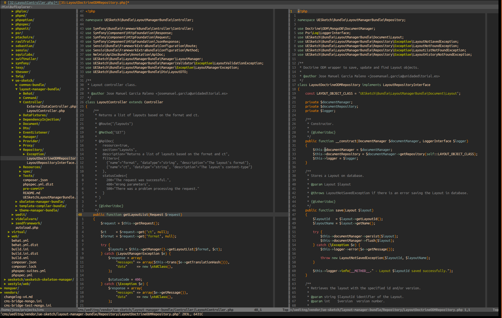

# Vim-config.

My personal vim config and plugins, PHP optimized. Looking for a vim reference? Check my [vim-reference](https://github.com/jmgarciamaleno/vim-reference) project.

I run only one vim instance and work with buffers (opened files). This allows to easily copy/paste content between them, run commands in all of them and keep a controlled set of classes and methods for omni-code completion.  
NerdTree, MiniBuffExplorer and CtrlP makes really easy to manage buffers.

I've found handy to use line relative numbers so you can see the distance to the line where you want to jump (i.e: 10 lines down) and get there with just `10j`. In insert mode normal numbers are displayed.  
To deactivate this behaviour, comment/remove the line `set relativenumber` in *.vimrc*.

This is how it looks like. You can see MiniBuffExplorer showing current buffers in the upper line:



## Install.

1. Backup your current vim files:

    ```bash
    cd ~
    mv .vimrc .vimrc_backup
    mv .vim .vim_backup
    ```

2. Install this project. This steps will install it in your home folder, for other folder replace `~` with the path you wish:

    ```bash
    cd ~
    git clone https://github.com/jmgarciamaleno/vim-config.git
    ln -s vim-config/vimrc ~/.vimrc
    ln -s vim-config/vim ~/.vim
    ```

## Uninstall.

1. Uninstall this project. If you didn't install this project at your home folder, replace `~` with the installation path:

    ```bash
    cd ~
    unlink ~/.vimrc
    unlink ~/.vim
    rm -rf vim-config
    ```

2. If you made a backup of your vim files, recover it:

    ```bash
    cd ~
    mv .vimrc_backup .vimrc
    mv .vim_backup .vim
    ```

## Optional but highly recommended.

1. The vim feature *xterm-clipboard* allows to copy/paste content from/to the system clipboard (vim register + or \*). Check `vim --version` to see which features are installed (the ones with +). In Ubuntu, the package *vim-gnome* adds the *xterm-clipboard* and other features to vim, install it with `sudo apt-get install vim-gnome`.

2. Install **exuberant-ctags** or **ctags** for better omni-code completion:
    - Debian based systems (Ubuntu): `sudo apt-get install exuberant-ctags`
    - OSX with brew: `brew install ctags`

    Info about how to construct your tags file and use it inside vim below.

3. For PHP: Install [php-cs-fixer](http://cs.sensiolabs.org/) to keep PHP coding standards. The **vim-php-cs-fixer** plugin is installed to make use of it.

## Custom mappings.

| Command | Action |
|---------|--------|
| ctrl-h | Previous buffer (h is left). |
| ctrl-l | Next buffer (l is right). |
| ctrl-n | Open/close NerdTree. |
| ctrl-p | Open/close Ctrl-P. |
| ctrl-t | Open/close TagBar. |

## Plugins list.

Light plugins which provide the features that I miss in the standard vim:

- [Ctrl-P](https://github.com/kien/ctrlp.vim)
- [MiniBuffExplorer](https://github.com/fholgado/minibufexpl.vim)
- [MultipleCursors](https://github.com/terryma/vim-multiple-cursors)
- [NerdTree](https://github.com/scrooloose/nerdtree)
- [PHPComplete](https://github.com/shawncplus/phpcomplete.vim)
- [Snipmate](https://github.com/msanders/snipmate.vim)
- [Syntastic](https://github.com/scrooloose/syntastic)
- [Tagbar](https://github.com/majutsushi/tagbar)
- [Vim-autoclose](https://github.com/Townk/vim-autoclose)
- [Vim-JavaScript](https://github.com/pangloss/vim-javascript)
- [Vim-JSON](https://github.com/elzr/vim-json)
- [Vim-PHP-cs-fixer](https://github.com/stephpy/vim-php-cs-fixer)
- [Vim-Twig](https://github.com/beyondwords/vim-twig)

## Plugins basic commands.

### NerdTree.

Sidebar file explorer. Press `?` in NerdTree for quick key reference. Basic commands:

| Command | Action |
|---------|--------|
| ctrl-n | Open/close NerdTree. |
| o | Open node. |
| x | Close parent node. |
| s | Open node vertically splitted. |

### Ctrl-P.

Fuzzy file finder.

| Command | Action |
|---------|--------|
| ctrl-p | Open/close Ctrl-P. |
| ctrl-d | Change mode between path, files and MRU. |
| ctrl-z | Mark multiple files. |
| ctrl-o | Open marked files. |

### Multiple-cursors.

This plugin allows to select the word under the cursor and the next occurrences, to edit them all at the same time.

| Command | Action |
|---------|--------|
| ctrl-k | Switch to select mode and selects word under cursor and next occurrences. |
| ctrl-p | (Select mode) Deselect current word. |
| ctrl-x | Skip current selected word. |

### Exuberant-ctags / Ctags.

Not a vim plugin but a shell tool. It constructs a tags file with classes, methods, etc. for the given code language and folders.

Run this bash command (replace PHP with your code language) at your project root to construct the tags file with class and methods only:

```bash
exuberant-ctags --languages=PHP -R --links=no --PHP-kinds=cf <path1_to_your_code> <path2_to_your_code> ...
```
or

```bash
ctags --languages=PHP -R --links=no --PHP-kinds=cf <path1_to_your_code> <path2_to_your_code> ...
```

Run vim at your project root to make use of the created tags file.

| Command | Action |
|---------|--------|
| ctrl-n | (Insert mode) Completes the word being written with the next coincidence. |
| ctrl-p | (Insert mode) Completes the word being written with the previous coincidence. |
| :tag \<className> | Opens the \<className> definition. |
| ctrl-] | Open the class/method definition of the word under the cursor. |
| ctrl-w + ] | Opens the class/method definition of the word under the cursor in a new window. |
| ctrl-t | Return to the point where the class/method definition was called. |

### Vim-php-cs-fixer.

[Php-cs-fixer](http://cs.sensiolabs.org/) is a great shell tool to automatically fix PHP coding standards for the given file, or files under the given folder. This plugin allows to apply **php-cs-fixer** from vim.

If you run `\pcf` without arguments, the current buffer is fixed and saved. Reload the buffer with `:e!` to see it updated.

You can set the fixing level that you want to apply in your vim config (my default value is PSR2).

| Command | Action |
|---------|--------|
| \pcf | Fix coding standards of the current buffer. |
| \pcf \<file> | Fix coding standards of \<file>. |
| \pcd \<folder> | Fix coding standards of files under \<folder>. |

---

<center>Jose Manuel García Maleno - jmgarciamaleno@gmail.com - @jmgarciamaleno</center>

